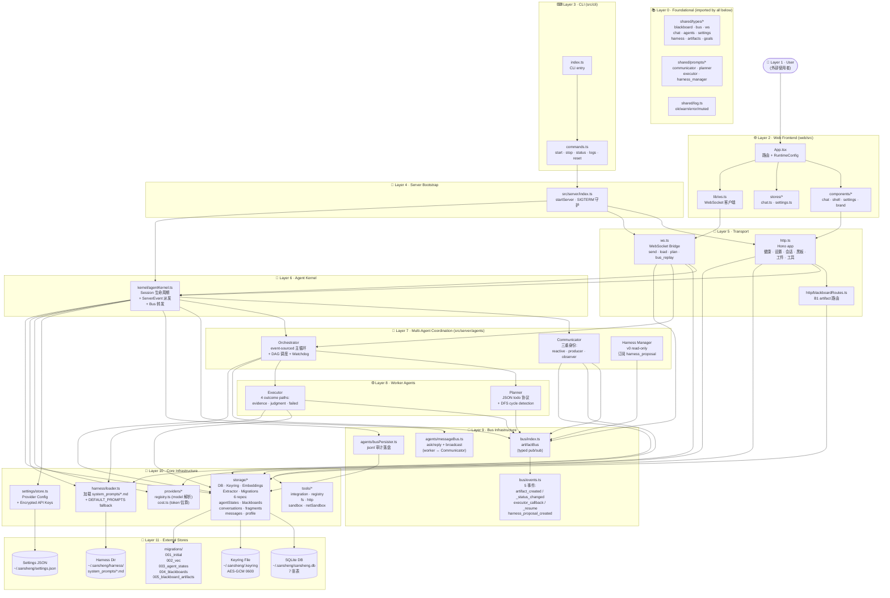

# Sansheng · 系统功能模块图

**生成时间**: 2026-10-01
**版本**: v1.0
**布局**: 自顶向下,严格层次化,所有箭头单向向下 → **无交叉**

---

## 模块层次(自上而下)

| 层 | 名称 | 职责 |
|---|---|---|
| 0 | Foundational | shared/types · shared/prompts · shared/log |
| 1 | User | 外部使用者 |
| 2 | Web Frontend | React 应用 + 路由 + 组件 + Stores |
| 3 | CLI | commands · start/stop/status/logs/reset |
| 4 | Server Bootstrap | startServer + 守护进程 |
| 5 | Transport | HTTP · WS · artifact 路由 |
| 6 | Agent Kernel | Session 管理 + ServerEvent 派发 |
| 7 | Multi-Agent Coordination | Communicator · Orchestrator · Harness Manager |
| 8 | Worker Agents | Planner · Executor |
| 9 | Bus Infrastructure | artifactBus · MessageBus · BusPersister |
| 10 | Core Infrastructure | Storage · Settings · Providers · Harness Loader · Tools |
| 11 | External Stores | SQLite · Keyring · Settings JSON · Harness Dir · Migrations SQL |

---

## 功能模块图(Mermaid)



---

## 模块依赖矩阵(快速参考)

| 模块 | 直接依赖 |
|---|---|
| **App.tsx** | Components, Stores, LibWS |
| **Components/chat** | (UI 纯组件) |
| **Components/shell** | (UI 纯组件) |
| **lib/ws.ts** | (浏览器 WS) |
| **stores/chat.ts** | (Zustand state) |
| **stores/settings.ts** | (Zustand state) |
| **CLI commands** | server/index (startServer), SettingsStore, Keyring, Storage |
| **http.ts** | Hono, settings, kernel(type), storage, tools(integration), blackboardRoutes |
| **http/blackboardRoutes** | storage |
| **ws.ts** | kernel, settings, storage, orchestrator, bus |
| **agentKernel** | settings, providers, storage, messageBus, communicator, harness/loader, busPersister |
| **Communicator** | artifactBus, messageBus, providers, harness/loader, runner |
| **Orchestrator** | artifactBus, storage, planner, executor |
| **Harness Manager** | artifactBus |
| **Planner** | artifactBus |
| **Executor** | artifactBus, storage, harness/loader |
| **Bus Persister** | storage |
| **Storage** | DB, Keyring, Embeddings, Extractor, Migrations, 6 repos |
| **Settings** | Keyring (encryption) |
| **Tools/integration** | registry, sandbox, netSandbox, fs, http |

---

## 关键数据流

### Flow A · 用户消息处理

```
User → App.tsx → ChatSurface
        ↓ WS send
WS → agentKernel.handleSend
        ↓
AgentKernel.resolveActiveModel + createAgentSession
        ↓
Pi Session 内部 LLM 流 → ServerEvent 流
        ↓
WS 广播 → ChatSurface 渲染
        ↓ (extractor)
Storage.insertFragment + embedText → SQLite + vec
```

### Flow B · 多 Agent 协作

```
User 发送 "plan xxx" → ws.ts handlePlan
        ↓
ws.ts 新建 Orchestrator → artifactBus.publish("artifact_created", intent)
        ↓
Orchestrator.run → 订阅 bus → spawn Planner
        ↓
Planner 产 todo → Orchestrator 按 DAG 调度 Executor
        ↓
Executor 阻塞回调 → bus.executor_callback → Communicator 决策
        ↓
Communicator emit decision artifact → bus.executor_resume → Executor 继续
        ↓
全部 todo resolved → intent resolved → Communicator observer 触发 user 通知
```

### Flow C · 工具调用(M4)

```
Agent 决定调工具 → tools/integration.createToolRegistry
        ↓
ToolRegistry.get(name) → 沙箱 + net policy 校验
        ↓
fn(args) → Sandbox.fs / Sandbox.net
        ↓
返回 result → Agent 继续
```

---

## 渲染建议

- **GitHub / GitLab**:直接粘贴 Mermaid 块即可渲染
- **本地**: `npx -p @mermaid-js/mermaid-cli mmdc -i ARCHITECTURE.md -o arch.pdf`
- **VS Code**:安装 "Markdown Preview Mermaid Support" 扩展